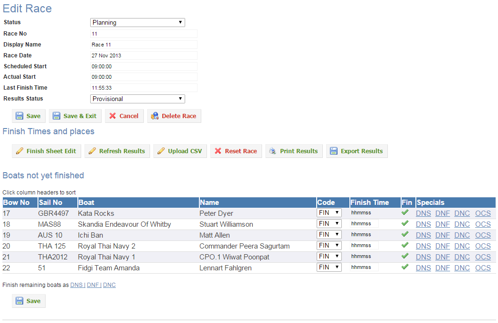

## Overview
Entering results (finish times or finish places) is dependent on the Results Type for the Class. If the Results Type is "Place" the system only allows the entry of a place (1, 2, 3, etc). If the Results Type is Time, the system allows the entry of finish times only.

In both cases the system has multiple ways in which the results can be entered. The most commonly used method is the One Click Finish. Using this method the minimum number of keystrokes is required. For a Class with a Results Type of Place, only a single click is required. For a Class with a Results Type of Time you are required to enter the actual finish time and then a single click. In the case of Time, the Corrected Time is automatically calculated and the correct finishing order is determined by the system. Points are automatically applied.

For all Results Types (Time or Place), special finish results can be applied with a single click. These include DNF, DNS, RAF etc.

The steps are the same for both Time and Place classes:

Open the Class Dashboard
In the Class Control panel click the Tick.png or Cog.png icon in the column corresponding to the required race number.
The system will open the Race page for the required race
Enter Finish Times or Places as described below
When all results are entered, change the Race Status to Published
Click Save & Exit
For all Results Types, the Race page is divided into 4 sections

Race Properties - For more details see Create Race
Finish Time and Place Functions - these functions are described below.
Finish Times and Places - This section shows a table of the boats which have finished, the place and points awarded, and, if the Result Type is Time, the Elapsed Time, TCF and Corrected Time.
Boats Not Yet Finished - This is a table of the boats which have not yet finished.

## Entering Finish Places and Times by Race
### Entering Finish Positions using One Click (Boat by boat) Entry

**This applies to a Class with a Results Type of PLACE.**

Using the steps above, access the Race page for the required Class and Race. The picture below shows a sample Finn Class for race 9.

The picture shows that 3 boats have finished. AUS26 is in 3rd place. AUS2, AUS5 and AUS22 have not yet finished. If the next boat to finish is AUS22, click the Tick.png in the Fin column.

The system will finish AUS22 in 4th place and move him to the Finish Times and Places table.

You could use this method to finish the remainder of the class.

**Correcting Mistakes and Re-Ordering Finishers**

Quite often the Race Committee will correct their results or you may have made an error in entering them. There are 3 methods to correct errors.

Use Move Up/Down Arrows  
Reset Race results 
Use Finish Sheet Edit 

**Move Up/Down Arrows**  

These icons allow you to move a boat one place up or down. When you click one of the arrows the boat is moved in the required direction and the adjacent boats are re-ordered and rescored.

### Entering Finish Times using One Click (Boat by boat) Entry

**This applies to a Class with a Results Type of TIME.**

Using the steps above, access the Race page for the required Class and Race. The picture below shows a sample IRC Class for race 11.

The picture shows that no boats have finished. For each finisher, select the Finish Code (FIN = normal finish), enter the finish time by overwriting the hhmmss then click the Tick.png in the Fin column.

The system will finish Kata Rocks using the entered time and his TCF, then move him to the Finish Times and Places table. Entering finish times for multiple boats is also easy. For each boat, select the Finish Code, enter the finish time by overwriting the hhmmss then click the SAVE button below.

You could use this method to finish the remainder of the class.

### Correcting Mistakes and Re-Ordering Finishers

Quite often the Race Committee will correct their results or you may have made an error in entering them. To correct the entry there are three methods:

Use  to open the RaceResult screen. Edit the finish time and click Save.
Use  to delete the finish result and re-enter it using the methods above.
Use Finish Sheet Edit 
After changing a finish time, always recalculate the race results using the Reset-race-button.png

### DNF, DNS, DNC and OCS

The Race Committee will often score a boat DNF (Did Not Finish), DNS (Did Not Start), DNC (Did Not Compete) or OCS (On Course Side at Start) where the boat has not started or completed the course. To enter these scores quickly, click the required Score to the right of the Tick.png icon.

The system will score AUS5 DNF and move him to the Finish Times and Places table.

Note that there are many other special scores that could be used. These are available in the Select List to the left of the 

**Reset Race Results**

This function will delete all race results to date and move all boats back to the Not Yet Finished table.

**Finish Sheet Edit**

This function will open a worksheet which allows you to manually adjust any or all of the results.

### Entering Protest Scores

Following a protest a boat which may have been scored as finished may need to be

- be scored as DSQ (disqualified)

- be scored in a specific place or with specific points
- be awarded redress in some form

It is vital to read the Jury decision carefully and consult with the Jury Secretary if there is any doubt.

**Scoring a Boat DSQ**
**Scoring a Boat with a specific place or points**
**Awarding a Boat Redress**

### Finish Times and Places Bulk Entry Using Finish Sheet

**Key Concepts**
This function allows you to enter the finish times or places for multiple boats in multiple classes using a single form. To access this function, click the Finish Sheet button on the Class Dashboard.

This function will gather all UNFINISHED boats for the LAST RACE of each class. The unfinished boats are displayed on a single screen.

You can FILTER this sheet for particular classes using the Filter Classes button.

For classes with result type of TIME you must enter the Finish Time.

For classes with result type of PLACE you only need to click the FIN button. The order in which you click the FIN button determines the finish order. You can re-order the finishers using DRAG & DROP.

**The Finish Sheet**
To access the Finish Sheet, click the Finish Sheet button on the Class Dashboard. 

The system will determine the unfinished boats from the last race of each class and display them in a single screen. You can change the sort order by clicking on the table column headers. You can change which classes are displayed by clicking the Filter Classes button. 

